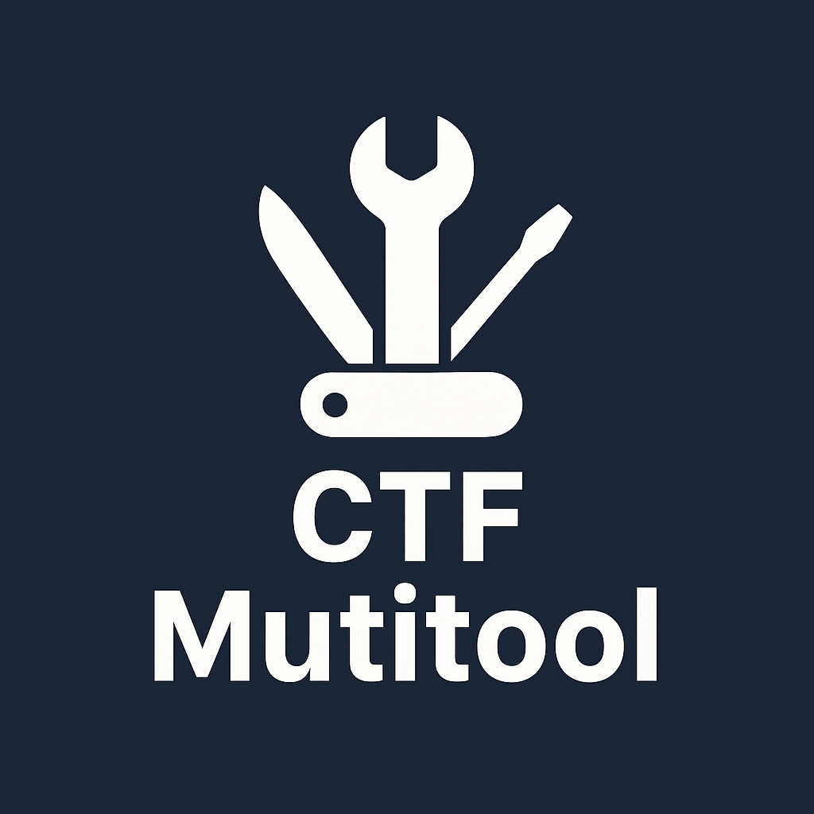

<h1 align="center">
  <br>
  <a href="https://github.com/OlsonTyler0/ctf-multitool"></a>
  <br>
  CTF Multitool
  <br>
</h1>

<h4 align="center">A collection of Capture the Flag tools and repositories.</h4>

-------------------

# Table of contents
1. [Big tool repositories](#tool-repositories)
2. [General](#general)
3. [Cryptography](#cryptography)
4. [Forensics](#forensics)
5. [OSINT](#OSINT)
6. [PWN](#pwn)
7. [Learning](#learning)

--------------------

## Tool Repositories
--------------------
> This includes other CTF tool repositories that might contain more tools than what you might find here. Check them out!
- [gregalletti CTF Tools Repository](https://github.com/gregalletti/CTF_tools)
- [John Hammond's CTF Tools Repository](https://github.com/JohnHammond/ctf-katana)
- [Osint Tool Collection](https://cipher387.github.io/osint_stuff_tool_collection/)

## General
----------
> A list of general tools that can be used to assist with CTF challenges
- [Hex Editor](https://hexed.it/) - Online hex editor tool that can help with hex-related challenges
- [Multi-converter](https://www.rapidtables.com/convert/number/ascii-hex-bin-dec-converter.html) - Converts all kinds of basic crypto and text methods on the fly 
Collaboration tools
- [Codimd](https://github.com/hackmdio/codimd) - An open source web application allowing for collaborative markdown editing.
- [PwnHub](https://github.com/Maybe4a6f7365/PwnHub) - Open source collaboration platform allowing the collaboration of a single team. Ironically made with shell files.

## Cryptography:
----------------
- [Cyberchef](https://gchq.github.io/CyberChef/) - Tool to perform anything you ever wish
- [d.code](https://www.dcode.fr/en) - The godlike cryptography tool
- [Boxentriq Cipher Identifier](https://www.boxentriq.com/code-breaking/cipher-identifier) - Cryptography tool great at identifying what a cipher is
- [Xor Calculator](https://xor.pw/) - A great calculator for XOR 
- [RSA ctf tool](https://github.com/RsaCtfTool/RsaCtfTool) - an RSA attack tool to retrieve a private key from a wek public key
- 

## De-obfuscation
-----------------
- [Prettier Playground](https://prettier.io/playground/) - Messy looking long code? Use this to help!
- [Javascript Beutifier](https://beautifier.io/) - A similar tool to pretty longer code
- [Javascript UnPacker](https://matthewfl.com/unPacker.html) - Packed Java script? Utilize this to help unpack it.
**Example of packed java script:** 
```js
eval(function(p,a,c,k,e,r){e=String;if(!''.replace(/^/,String)){while(c--)r[c]=k[c]||c;k=[function(e){return r[e]}];e=function(){return'\\w+'};c=1};while(c--)if(k[c])p=p.replace(new RegExp('\\b'+e(c)+'\\b','g'),k[c]);return p}('(0(){4 1="5 6 7 8";0 2(3){9(3)}2(1)})();',10,10,'function|b|something|a|var|some|sample|packed|code|alert'.split('|'),0,{}))
```

## Forensics
------------
- [evtxview](github.com/janstarke/evtxview) - GUI for microsoft eventx files, python in nature so can run anywhere 
- [Zip File Cracker](https://passwordrecovery.io/zip-file-password-removal/)

**Online Code Runner**
- [JavaScript](https://jsconsole.com/) - Runs javascript
- [online-python](https://www.online-python.com/) - Runs 


## OSINT
--------
> Gathering open source information 
### DNS / Web
- [WhatsMyName Web](https://whatsmyname.app/) - Great tool to search usernames accross the internet
- [Internet Archive](https://archive.org/) - A look back in time on websites
- [DNS Dumpster](https://dnsdumpster.com/) - Dumps all of the DNS of a website
- [URLScan.io](https://urlscan.io/) - An amazing tool to scan websites for additional information.

### Corporate Information
- [Open Corporates](https://opencorporates.com/) - Gather open corporate information 
- [Epieos](https://epieos.com/) - A big osint website.
- [Who Is Domain Search](https://who.is/) - Great for gathering whois information of websites
- [The Harvester](https://github.com/laramies/theHarvester) - Tool designed to gather emails, ips, subdomains, and urls from public resources.

**Other**
- [PGP Keyserver](https://keyserver.ubuntu.com/) - If any challenges wants you to look for specific PGP keys.
- [Search By Image Extension](https://addons.mozilla.org/en-US/firefox/addon/search_by_image/) - Assists in searching images accross many search engines.

**Resources**
- [osint_stuff_tool_collection](https://cipher387.github.io/osint_stuff_tool_collection/)
- [Intel techniques](https://inteltechniques.com/tools/index.html)
- [Osint Framework](https://osintframework.com/)

## Steganography 
----------------
- [Aperi'Solve](https://aperisolve.fr/) - One of the best solvers for stegonography images


## PWN


## Learning
**Recomended Videos:**
- [Competing in the ALLES. CTF - Team Recording in Real Time](https://www.youtube.com/watch?v=DGuRI_SPZYg) - A great video about the Alles! ctf team playing in a Google CTF Finals. Talking all aobut methodologies and how they go through competitions
- [Real world CTF Finals 2018](https://www.youtube.com/watch?v=2S_TXaGYD8E) - A great video from LiveOverflow about an in person capture the flag competition that was held in china.
- [Advanced tips and tricks for capture the flag](https://www.youtube.com/watch?v=Vh3gN-Pog1k&t=934s) an AMAZING talk from John Hammond about capture the flags.

**Youtube Channels:**
- [Live Overflow](https://www.youtube.com/@LiveOverflow) - A great world class CTF player who has amazing videos on different topics related to CTF's and cybersecurity.
- [John Hammond](https://www.youtube.com/@_JohnHammond) - A great channel to help begginers learn advanced security. 
- [Matt Brown](https://www.youtube.com/@mattbrwn/videos) - Red Team related channel, talks a lot about red-tema related content

**Reading content**
- [Hack Tricks Book](https://book.hacktricks.wiki/en/index.html) - A book all about red team and other cybersecurity related topics. A great read for those interested in capture the flags.
- [Humble Bundle](https://www.humblebundle.com/) - Occasionally has really good deals related to cybersecurity

### Practice Challenges
- [Under the Wire Wargames](https://underthewire.tech/wargames)- Games to exercise additional learning in capture the flags.
- [Pico CTF](https://picoctf.org/) - Small capture the flag challenges to exercies the brain
- [Pwnable](http://pwnable.kr)
